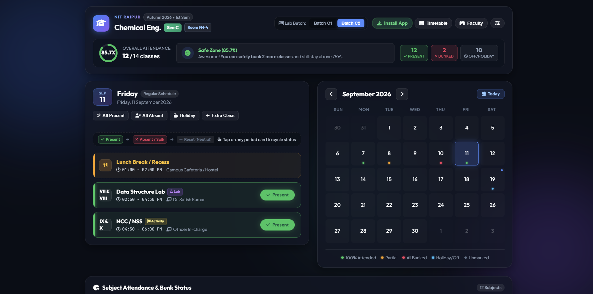
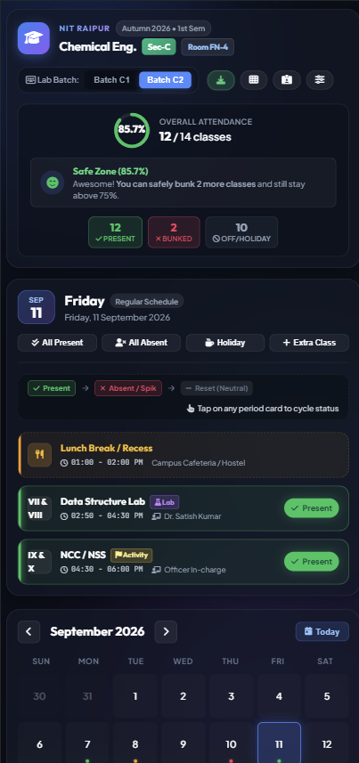

# 🎓 NIT Raipur Attendance & Bunk Manager

<div align="center">

[](https://iamumangv.github.io/NIT_Attendance/)
[](https://iamumangv.github.io/NIT_Attendance/)
[](https://iamumangv.github.io/NIT_Attendance/)

### 🌐 **Live Website**: [https://iamumangv.github.io/NIT_Attendance/](https://iamumangv.github.io/NIT_Attendance/)

</div>

> A sleek, glassmorphic Progressive Web Application (PWA) built for **NIT Raipur Chemical Engineering (Section-C)** students to track daily attendance, manage safe bunks, and maintain attendance above the required 75% threshold.

---

<!-- Placeholders for Screenshots -->
## 📸 Screenshots

<div align="center">

### 💻 Desktop / Laptop View (Side-by-Side Schedule & Calendar)


<br/><br/>

### 📱 Mobile View (Stacked Responsive Cards)


</div>

---

## ✨ Features

- **🎯 Bunk-O-Meter & Smart Target Advisor**:
  - Automatically computes overall and subject-wise percentage.
  - Dynamically calculates **safe bunks remaining** before falling below your target (e.g. 75%).
  - Provides instant recovery guidance: tells you exactly how many consecutive classes you must attend if you are in the danger zone.
  - Configurable target percentage (default: 75%).

- **🗓️ Pre-Configured Official Timetable**:
  - Pre-loaded with official NIT Raipur Chemical Engineering (Sec-C, Room FN-4) schedule.
  - **Batch C1 / C2 Switching**: Automatically swaps practical lab sessions and faculty allocations based on your selected lab batch.
  - Recess, period numbers, exact timings, and faculty names built in.
  - Friday Data Structure Lab updated to start from 2:50 PM.
  - Every period ID has a clean, uniform single attendance weight (`countWeight: 1`).

- **⚡ Fast Daily Attendance Logging**:
  - **1-Tap Cycle Status**: Tap any period card to cycle through `Present` ➔ `Absent / Spik` ➔ `Reset (Neutral)`.
  - **Quick Action Pills**: Mark "All Present", "All Absent", or flag the day as "Holiday / No Class" with a single click.
  - **Extra Class Support**: Easily log impromptu extra lectures or makeup classes for any day.

- **📊 Subject-Wise Progress & Course Breakdown**:
  - Visual color-coded attendance progress bars (`Safe >= 75%`, `Warning 65-74%`, `Danger < 65%`).
  - Total classes attended vs. held breakdown for each individual course and practical lab.
  - Clear bunk advice for every single course.

- **📅 Interactive Multi-Month Calendar**:
  - Color-coded day dots reflecting attendance status (100% Attended, Partial, All Bunked, Holiday, Unmarked).
  - Fast month navigation and "Today" jump button.
  - Tapping any date instantly loads and displays that day's schedule.

- **📱 Fully Responsive Adaptive Layout**:
  - **Laptop & Tablet Landscape**: Schedule Card and Calendar Card display **side-by-side** for frictionless day-by-day navigation, with Subject Breakdown spanning full width underneath.
  - **Mobile & Tablet Vertical (Portrait)**: Cards automatically stack **one below one** with clean spacing and readable typography.

- **💾 100% Private & Offline First (PWA)**:
  - All data is stored locally on your device via `localStorage`. Zero trackers, zero cloud dependencies.
  - Installable as an app on Android, iOS, and PC (PWA supported with offline service worker).
  - **Backup & Restore**: Export your attendance data as a `.json` backup file or restore it anytime on another device.

---

## 🏛️ Timetable Overview (Sec-C)

- **Department**: Chemical Engineering (Section-C)
- **Classroom**: Room FN-4
- **Working Days**: Monday – Friday (Saturday & Sunday Off)
- **Batch Division**: C1 / C2 for Practical Labs (Physics-II Lab, Environment & Ecology Lab, Engineering Mechanics Lab)

---

## 🚀 Getting Started

### Option 1: Open Live Web App (Recommended)
Simply visit the hosted web application:
👉 **[https://iamumangv.github.io/NIT_Attendance/](https://iamumangv.github.io/NIT_Attendance/)**

### Option 2: Install as a PWA (Phone / PC)
1. Open **[https://iamumangv.github.io/NIT_Attendance/](https://iamumangv.github.io/NIT_Attendance/)** in Chrome, Edge, or Safari.
2. Click the **"Install App"** button in the top navigation bar (or use your browser's menu: **Install App** / **Add to Home Screen**).
3. The app will be installed on your device with standalone display, launcher icon, and full offline caching support!

### Option 3: Run Locally

1. Clone or download this repository:
   ```bash
   git clone https://github.com/iamumangv/NIT_Attendance.git
   cd NIT_Attendance
   ```
2. Open `index.html` directly in any web browser, or serve it using a simple HTTP server:
   ```bash
   # Using Python
   python -m http.server 8000

   # Or using Node.js
   npx serve .
   ```
3. Open `http://localhost:8000` in your browser.

---

## 🛠️ Tech Stack

- **Markup**: Semantic HTML5 with PWA Web App Manifest (`manifest.json`)
- **Styling**: Pure Modern CSS3 (Glassmorphism, CSS Grid, Flexbox, Custom CSS Variables, Ambient Glow Animations)
- **Logic**: Vanilla JavaScript (ES6+, DOM APIs, LocalStorage Engine, Service Worker API)
- **Icons & Fonts**: Font Awesome 6, Plus Jakarta Sans, Outfit, JetBrains Mono

---

## 📂 Project Structure

```text
NIT_Attendance/
├── index.html       # Primary application layout & modals
├── style.css        # Premium glassmorphic styles & responsive media queries
├── app.js           # Core state management, timetable definitions & calculation engine
├── sw.js            # PWA Service Worker for offline asset caching
├── manifest.json    # Web App Manifest for mobile/desktop app installation
├── icon-192.png     # App launcher icon (192x192)
├── icon-512.png     # App splash icon (512x512)
└── README.md        # Project documentation
```

---

## 🔒 Privacy & Data

All attendance entries are saved exclusively in your browser's `localStorage` under the key `nitrr_attendance_app_v1`. No data ever leaves your device. You can export and backup your records anytime through **Settings ➔ Export Backup (.json)**.

---

## 🤝 Contributing

Contributions, feedback, and timetable suggestions are welcome! Feel free to open an issue or submit a pull request.

---

## 📄 License

Distributed under the [MIT License](LICENSE).
